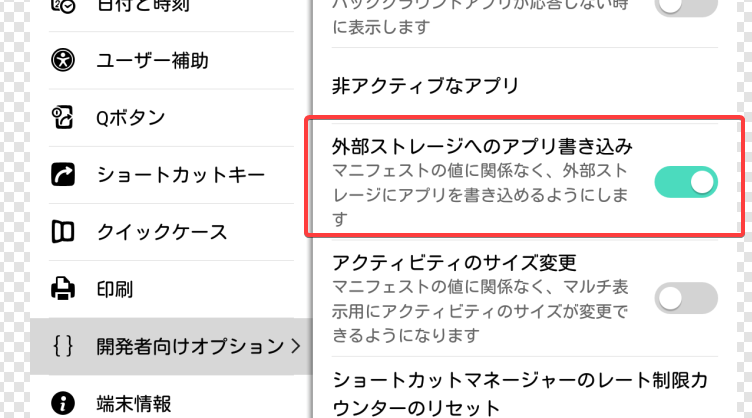
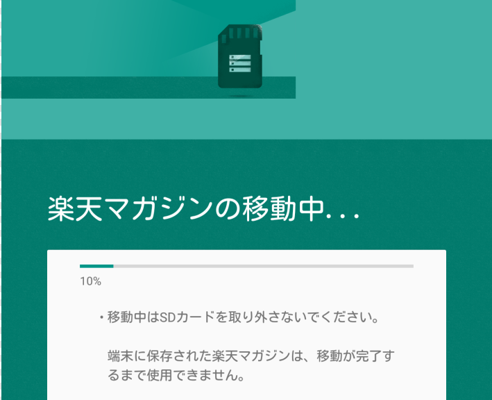

# SD カードをアプリを保存するためのストレージとして使う

前提として、**SDカード等の外部ストレージを `adb` コマンド等で内部ストレージ化している必要があります。**  
そちらの手順は、[こちら](https://sp7pc.com/google/android/24933) を見て頑張ってください。

* 開発者オプション --> 外部ストレージへのアプリ書き込み を有効化します。

* ✔ できた ❕

