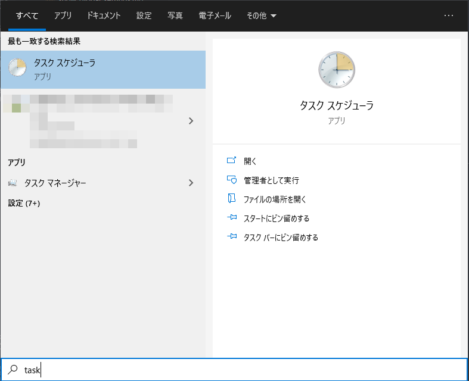

# 無効化しても良いタスク
* `タスク スケジューラ`で設定します。  

* コマンド経由で無効化することもできます。  
    * コマンド プロンプト (管理者権限)
        ```
        schtasks.exe /change /tn "タスクへのパス" /disable
        ```

タスク名は、例えば `Microsoft / Windows / Application Experience` の中にある `Microsoft Compalibility Appraiser` という名前のタスクを操作する場合、
```
\Microsoft\Windows\Application Experience\Microsoft Compatibility Appraiser
```
上記がそのままタスクへのパスとなります。  
注意が必要な点としては、`タスク スケジューラ`に表示されている `場所` の項目の値がタスクへのパスとはならないことです。  


## コピー・ペースト用コマンド
```
rem schtasks /change /Disable /TN "\Microsoft\Windows\Windows Media Sharing\UpdateLibrary"

schtasks /change /Disable /TN "\Microsoft\Windows\Application Experience\Microsoft Compatibility Appraiser"
schtasks /change /Disable /TN "\Microsoft\Windows\Application Experience\ProgramDataUpdater"
schtasks /change /Disable /TN "\Microsoft\Windows\Application Experience\StartupAppTask"
schtasks /change /Disable /TN "\Microsoft\Windows\Application Experience\StartupAppTask"
schtasks /change /Disable /TN "\Microsoft\Windows\Application Experience\Microsoft Compatibility Appraiser"
schtasks /change /Disable /TN "\Microsoft\Windows\Autochk\Proxy"
schtasks /change /Disable /TN "\Microsoft\Windows\Customer Experience Improvement Program\Consolidator"
schtasks /change /Disable /TN "\Microsoft\Windows\Customer Experience Improvement Program\KernelCeipTask"
schtasks /change /Disable /TN "\Microsoft\Windows\Customer Experience Improvement Program\UsbCeip"
schtasks /change /Disable /TN "\Microsoft\Windows\CloudExperienceHost\CreateObjectTask"

schtasks /change /Disable /TN "\Microsoft\Windows\Maintenance\WinSAT"

schtasks /change /Disable /TN "\Microsoft\Windows\Diagnosis\Scheduled"
schtasks /change /Disable /TN "\Microsoft\Windows\DiskFootprint\Diagnostics"

schtasks /change /Disable /TN "\Microsoft\Windows\DiskDiagnostic\Microsoft-Windows-DiskDiagnosticDataCollector"

schtasks /change /Disable /TN "\Microsoft\Windows\Windows Error Reporting\QueueReporting"

rem schtasks /change /Disable /TN "\Microsoft\Windows\Feedback\Siuf\DmClient"

rem schtasks /change /Disable /TN "\Microsoft\Windows\Location\Location"
rem schtasks /change /Disable /TN "\Microsoft\Windows\Location\WindowsActionDialog"

schtasks /change /Disable /TN "\Microsoft\Windows\Maps\MapsToastTask"
schtasks /change /Disable /TN "\Microsoft\Windows\Maps\MapsUpdateTask"
```

* 参考: [Windows10 快適にする不要なタスクスケジューラの停止 - Qiita](https://qiita.com/mkam/items/2764fc1e7198b571b62e)
