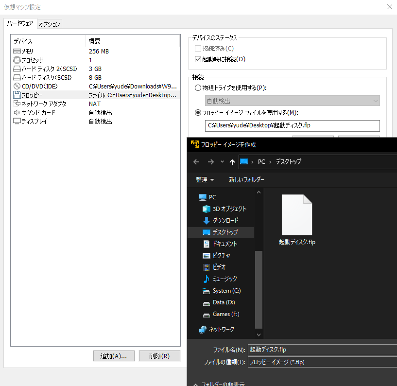
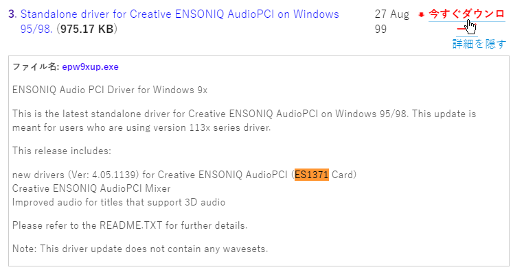
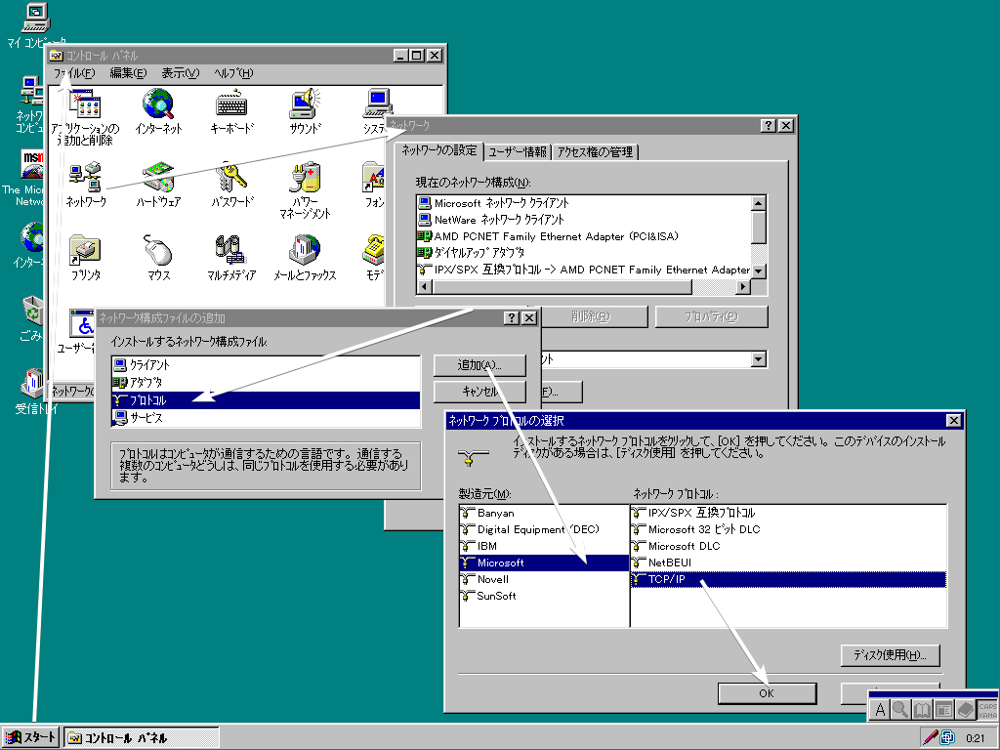

# VMware Workstation Player で Windows 9x 系を動かす

## 知見
* FreeDOS でも動かすことはできる。
* 予め仮想ハードディスクを Windows XP 等から FAT でフォーマットしておく。
* フォーマットした仮想ハードディスクに MS-DOS 6.22 (または [FreeDOS](https://www.freedos.org/download/)) と Windows 95 のセットアップディスクの中身を移しておき、それらを DOS から実行すると、ディスクドライブ等のドライバーに悩まされることがない。
* セットアップ終了後フロッピードライブを切断しないと DOS の画面に戻って起動できなくなる。 (?)
    * プロンプトされるのでそのタイミングで切断すれば良い。
* 万一の時のために起動ディスクは作成しておくべきである。
    * VMware の `flp` ファイルで良い。
    

## 音が出ない
* VMware Tools をインストールしても、サウンドドライバーはインストールされない。
* 以下の方法では MIDI の音が出ないかもしれないが、起動音や音声ファイル等に関しては再生できる。
* 参考: [VMWare に入ったWindows 95用のサウンドドライバ - Windows 2000 Blog](http://blog.livedoor.jp/blackwingcat/archives/1434847.html)
* `ES1371` という型番のデバイスのドライバーをインストールすればよい。
    * ダウンロード先: [Creative Media (Japan) : Customer Support - Drivers & more for all your Creative products](https://jp.creative.com/support/downloads/download.asp?Product_ID=420&Product_Name=Creative+Ensoniq+Audio+PCI&OSName=Windows+98&OS=2&DriverType=0&details=1)
    

## インターネットに接続する
行い  
